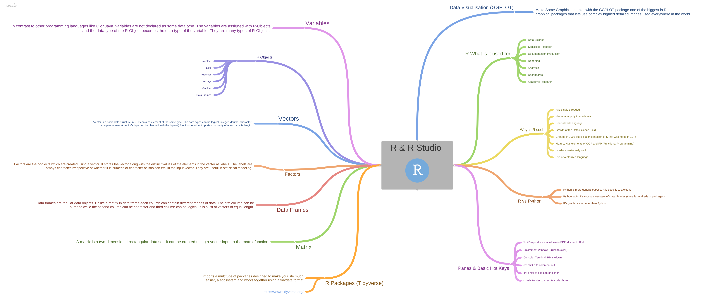

# rPrimer101

This git repostitory includes a R Markdown document. Markdown is a simple formatting syntax for authoring HTML, PDF, and MS Word documents. 
For more details on using R Markdown see <http://rmarkdown.rstudio.com>.

When you click the **Knit** button a document will be generated that includes both content as well as the output of any embedded R code chunks within the document. This can be converted to HTML, PDF, or DOCX content.

#R MindMap

